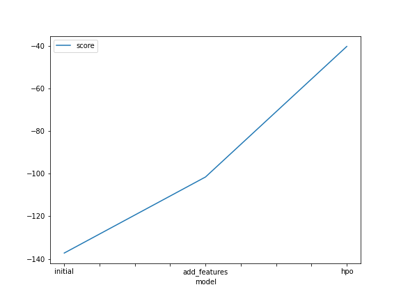
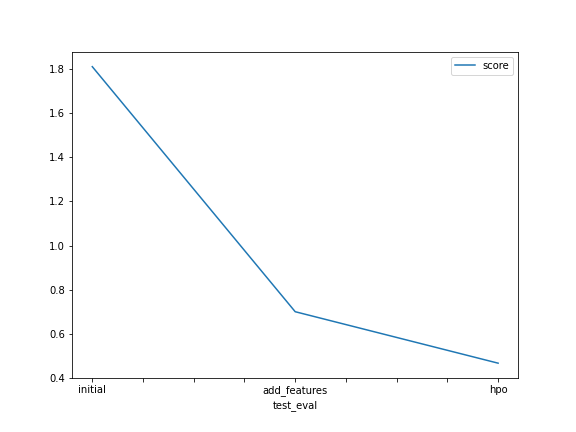

# Report: Predict Bike Sharing Demand with AutoGluon Solution
#### Jason Huang

## Initial Training
### What did you realize when you tried to submit your predictions? What changes were needed to the output of the predictor to submit your results?
- Found there are some negative value or float number of count from the predicted value.
    - For negative number, shall assign zero to the row.
    - For float number, shall round up to integer.

### What was the top ranked model that performed?
WeightedEnsemble_L3 in the hyper-parameter tuning case.

## Exploratory data analysis and feature creation
### What did the exploratory analysis find and how did you add additional features?
There is a missing value of the starting from 20th. So it is better to partition the date-time to hour, day, month perspective.

### How much better did your model preform after adding additional features and why do you think that is?
the test score decrease from 1.8 to 0.7. This benefit of splitting the datetime to that model to learn more specifically on particular time slot.

## Hyper parameter tuning
### How much better did your model preform after trying different hyper parameters?
he test score decrease from 0.7 to 0.47.

### If you were given more time with this dataset, where do you think you would spend more time?
study the correlation and do feature engineering to create better attributes to let model learn.

### Create a table with the models you ran, the hyperparameters modified, and the kaggle score.
|model|hpo1|hpo2|hpo3|score|
|--|--|--|--|--|
|initial|default|default|default|1.8102|
|add_features|default|default|default|0.7009|
|hpo|CAT(iterations),RF(n_estimators), XT(n_estimators)|GB(num_boost_round, num_leaves)|scheduler, searcher|0.46696|

### Create a line plot showing the top model score for the three (or more) training runs during the project.

### Create a line plot showing the top kaggle score for the three (or more) prediction submissions during the project.

## Summary
In this project, we learn the machine learning flow:
1. Review the dataset, find out the distribution and perform exploratory data analysis.
2. Based on the observation, conduct feature engineering, filling up the missing value and trying different feature composition
3. train the model, review the performance and back to step 1 and 2 to update the method.
4. figure our the best model for the problem.
